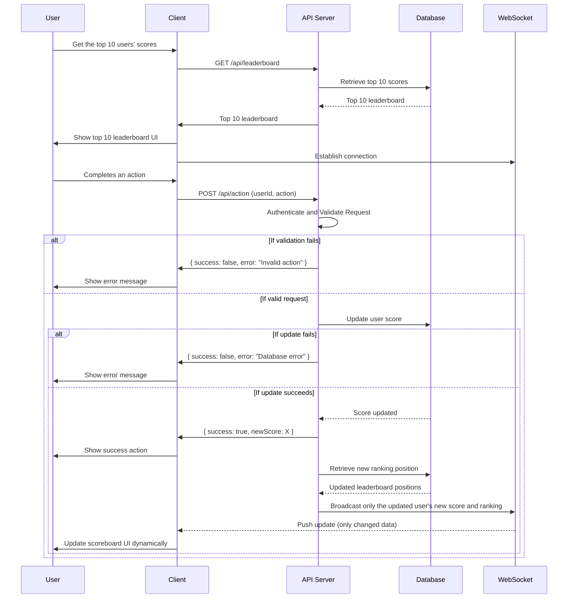

# Scoreboard API Module
## Overview

This module handles real-time score updates for a website leaderboard. Users earn points by completing specific actions, and their scores are updated accordingly. The scoreboard displays the top 10 users with the highest scores and updates live to reflect changes.

## Features

1.  **Score Update API** - Allows users to update their score upon completing an action.
2.  **Leaderboard API** - Fetches the top 10 users with the highest scores.
3.  **Real-time Updates** - Uses WebSockets to push score updates to clients.
4.  **Security & Authorization** - Prevents unauthorized users from manipulating scores.
5.  **Database Storage** - Persists scores efficiently for quick retrieval.

## API Endpoints

### 1. Update Score

**Endpoint:**  `POST /api/action`
**Description:** Increases the score of an authenticated user upon completing an action.
**Request:**
```json
{
"userId": string,
"action": enum.ACTION
}

```
**Response:**
```json
{
"success": boolean, //true if success
"newScore": number
}
```
**Security Considerations**
- Authenticate requests using JWT or API keys.
- Validate and verify input.
- Implement rate limiting to prevent abuse.
- Ensure only legit actions trigger score updates.

### 2. Get Leaderboard
**Endpoint:**  `GET /api/leaderboard`
**Description:** Retrieves the top 10 users with the highest scores.

**Response:**
```json
[{
"userId": string,
"score": number
}]

```
**Security Considerations**
- Cache results for optimal performance.

## Real-Time Updates

To ensure live updates of the scoreboard, a WebSocket connection will be used:
-  **Clients subscribe** to score updates.
-  **When a score changes**, the server broadcasts the update.
-  **Only relevant updates** are sent to reduce network load.

## Data Model
  
**User Scores Table**

| Field | Type | Description |

|-----------|--------|-------------------------------------|

| userId | String | Unique identifier for the user. |

| score | Int | Total score of the user. |

| updatedAt | Date | Timestamp of the last update. |


## Execution Flow Diagram


  ## Improvement Suggestions

1.  **Event-Driven Processing:** Consider using an event queue like RabbitMQ or Kafka to handle score updates asynchronously and improve scalability.

2.  **Distributed Caching:** Implement Redis or Memcached to cache leaderboard results and reduce database load.

3.  **Audit Logging:** Maintain a log of score updates to detect and prevent fraudulent activities.

4.  **Rate Limiting:** Use API rate limiting to prevent spam updates from malicious users.
